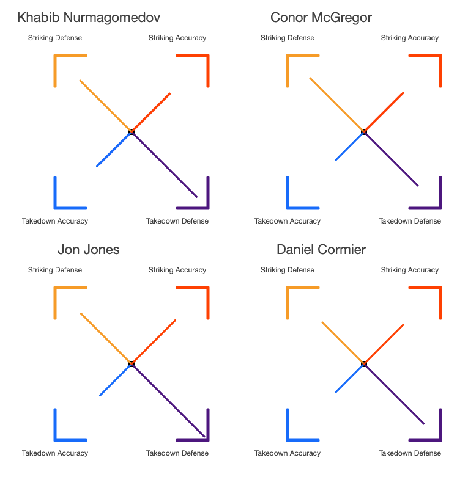

### Using p5.js

The purpose of this repo is to use [p5.js](https://p5js.org/) to create new an interesting visualisations for any project. 

This is a blank canvas for ideas.

#### UFC Quadrant
The first idea I came up with was a UFC quadrant stat for each fighter. 
. 

This is a visualisation that shows the Offense game vs Defense game for any fighter. The stats from straight from [UFC](https://www.ufc.com/athlete/khabib-nurmagomedov) (which can be scraped). And the % values for the Striking Accuaracy, Defence, Takedown Accuracy, Defense are plotted on the quadrant. 
THe screenshot shows a working prototype for Khabib Nurmagomedov, and can be extended to other fighters too.
